# startup_namer

A new Flutter application.

## Making Contribution

### Step 1: Git Clone

Clone the repository into your local machine using HTTPS or SSH.

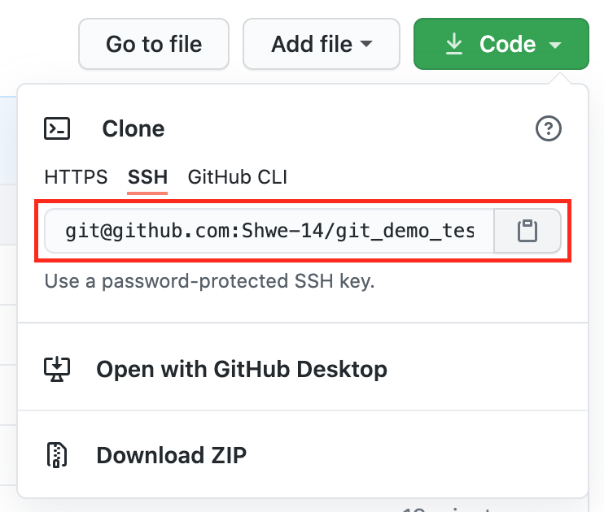  

`git clone git@github.com:Shwe-14/git_demo_test.git`

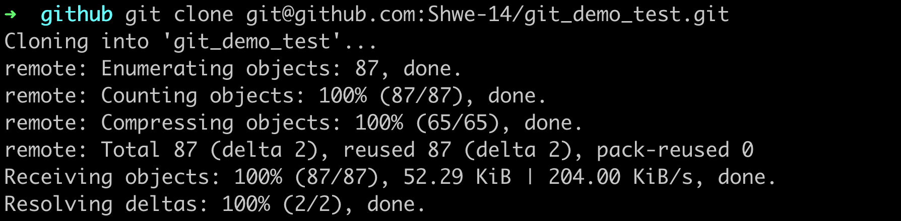  

### Step 2: Git Status/ Add/ Commit

Before creating a new branch, you have to do the following steps.  

1. `git status` (to see the changes.)  
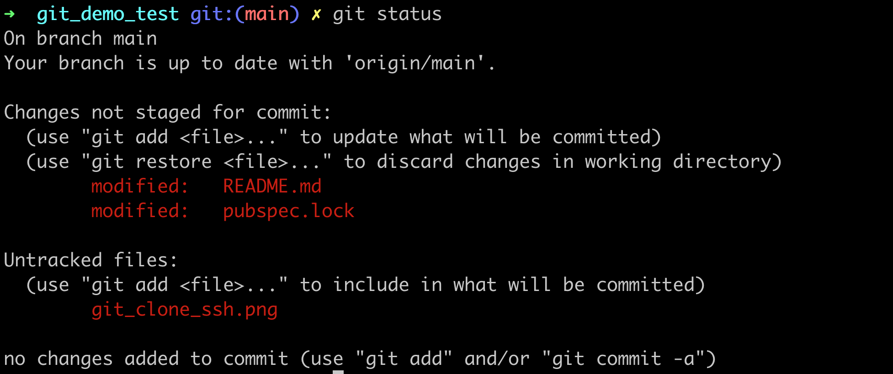  

2. `git add .` (to add the changes to a stage.)  
  

3. `git commit -m "commit_message"` (to confirm the changes with a commit message.)  
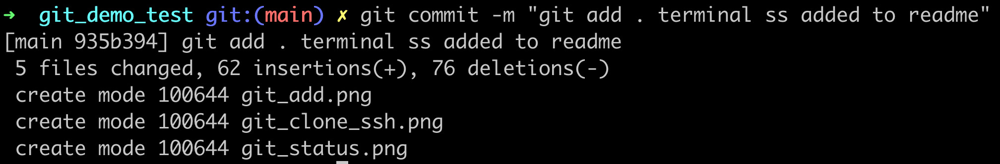  

### Step 3: Git Branch

Create a branch. Give the branch name something related to the feature you will work on or a bug supposed to be fixed. 
For example, `user_login_screen` or `login_error_fix`.  

1. `git checkout -b branch_name` (To create a new branch.)  
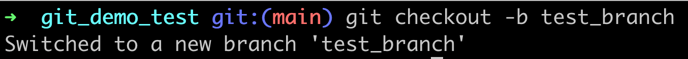  

2. `git branch` (To see branches you have.)  
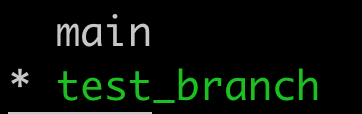  

3. `git checkout main` (To switch back to main branch)  
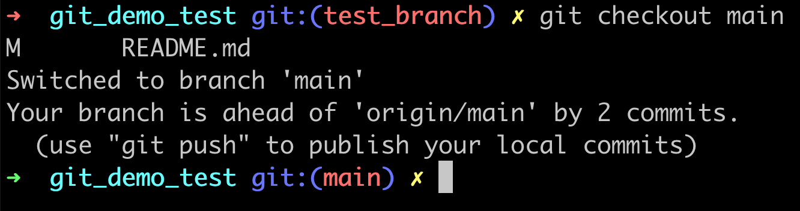  

Note: You cannot checkout of a branch without commiting first.  

### Step 4: Git Push  

Now you have made changes in one of the branches, and you have to push it to Github.  
`git push origin branch_name`  

### Step 5 A: Github Auto pull Request  

After pushing your `branch_name` to github, now you will see the green `Compare & pull request` button on Github.  
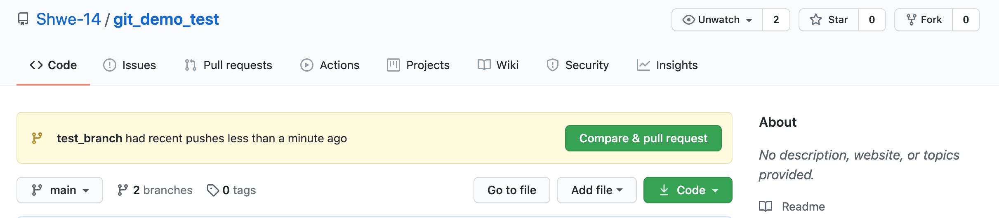  

And you will have to do the following steps. Start with creating pull request.  
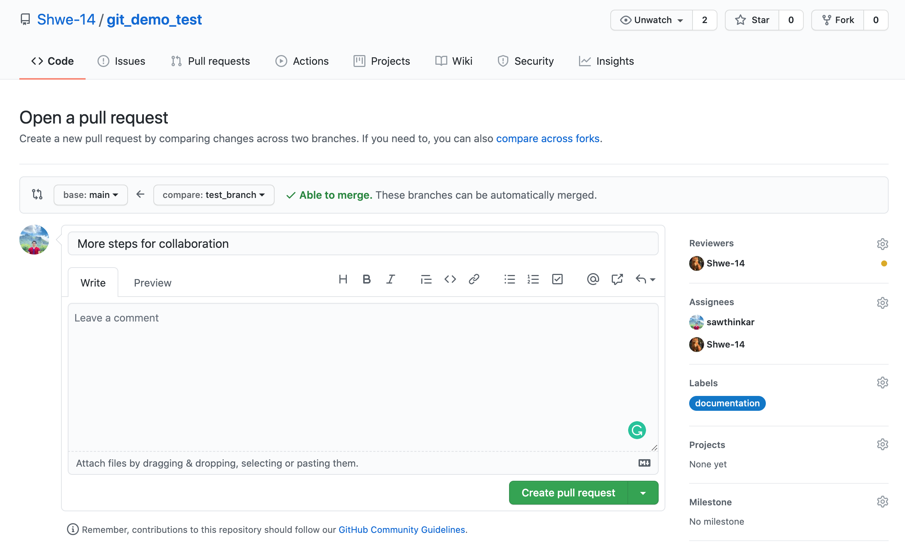  

And merge pull requests.  
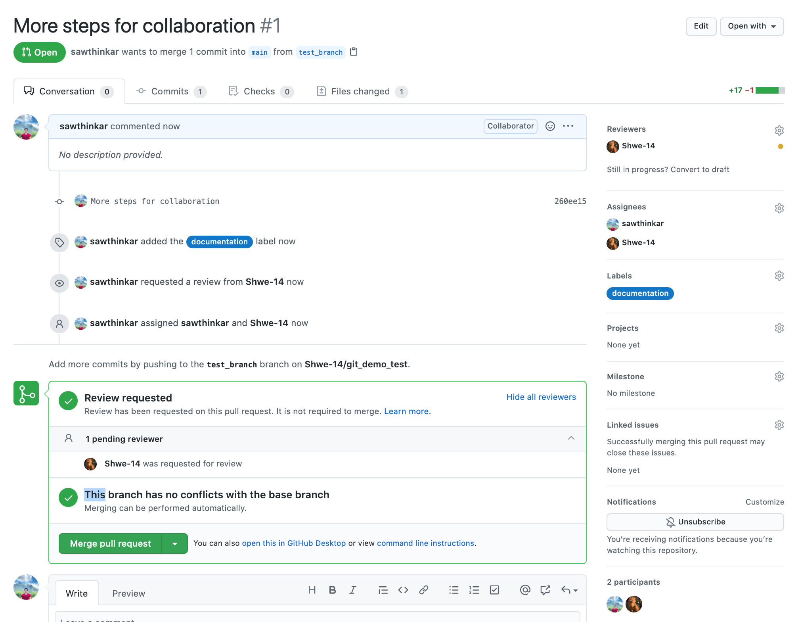  

Now, it is successuflly merged and you can delete the branch if you wish afterwards.  
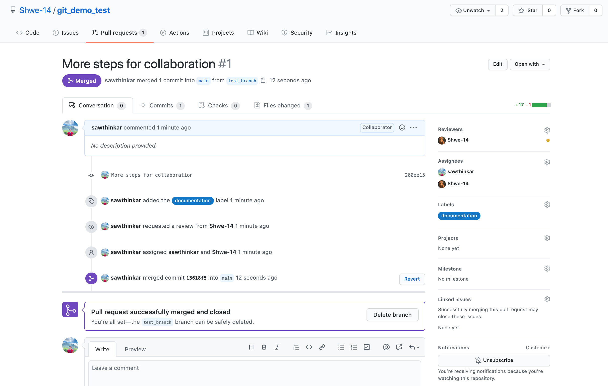  

### Step 5 B: Github Manual Pull Request  

You can go to `Pull requests` tab of your repo, and click `New` button.  
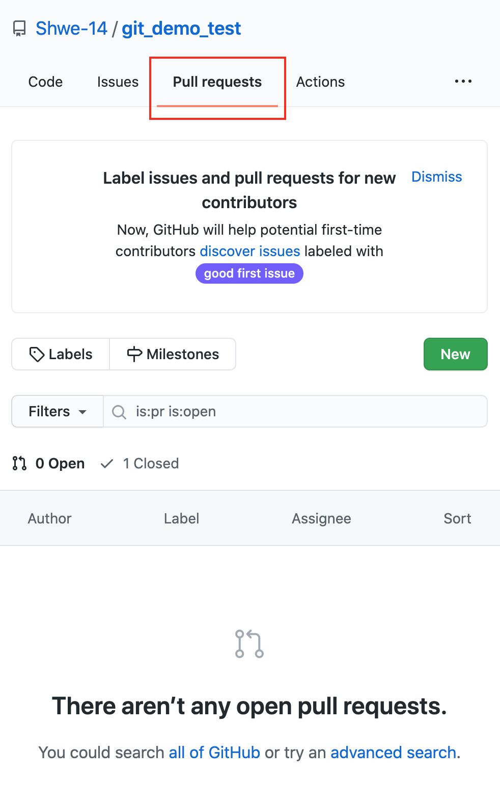  

Choose the branch you want to merge into your `main` branch.  
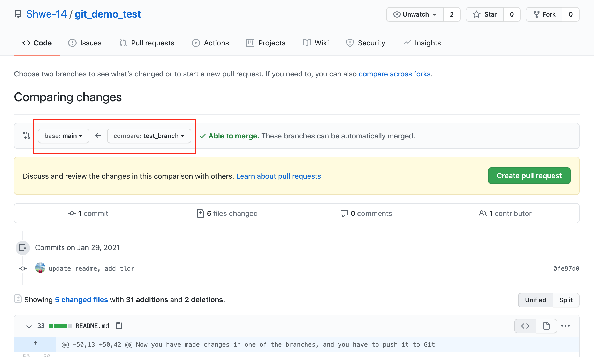  

### Step 6: Git Pull  

Now your `main` branch and newly created `branch_name` branch are merged into `main` branch in Github, but your `main` branch in local machine is not updated yet.  
So you have pull main branch by running the command below.  
`git pull origin main`  

### TL;DR  

1. create a new branch  
2. make changes in there  
3. push the new branch to github  
4. merge the new branch and the main branch  
5. pull the main branch back into your local  

OR (if your main branch has been updated by other contributors or members)

1. create a new branch  
2. make changes in there  
3. pull the main branch into your new branch  
4. solve the merge conflict if there's any  
5. push the new branch to github  
6. merge the new branch and the main branch  
7. pull the main branch back into your local  

## Getting Started

This project is a starting point for a Flutter application.

A few resources to get you started if this is your first Flutter project:

- [Lab: Write your first Flutter app](https://flutter.dev/docs/get-started/codelab)
- [Cookbook: Useful Flutter samples](https://flutter.dev/docs/cookbook)

For help getting started with Flutter, view our
[online documentation](https://flutter.dev/docs), which offers tutorials,
samples, guidance on mobile development, and a full API reference.
