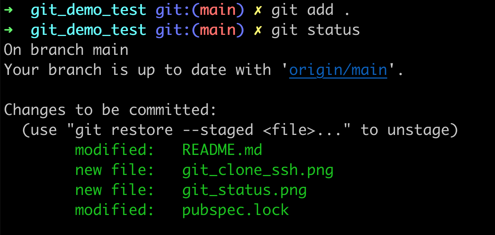

# startup_namer

A new Flutter application.

## Making Contribution

### Step 1: Git Clone  

Clone the repository into your local machine using HTTPS or SSH.

  

`git clone git@github.com:Shwe-14/git_demo_test.git`

  

### Step 2:  Git Status/ Add/ Commit  

Before creating a new branch, you have to do the following steps.  
1. `git status` (to see the changes.)  
  

2. `git add .`  (to add the changes to a stage.)  
  

3. `git commit -m "commit_message"`  (to confirm the changes with a commit message.)  
  

### Step 3:  Git Branch  

Create a branch. Give the branch name something related to the feature you will work on or a bug supposed to be fixed. For example, `user_login_screen` or `login_error_fix`.  

`git checkout -b "branch_name"`

## Getting Started

This project is a starting point for a Flutter application.

A few resources to get you started if this is your first Flutter project:

- [Lab: Write your first Flutter app](https://flutter.dev/docs/get-started/codelab)
- [Cookbook: Useful Flutter samples](https://flutter.dev/docs/cookbook)

For help getting started with Flutter, view our
[online documentation](https://flutter.dev/docs), which offers tutorials,
samples, guidance on mobile development, and a full API reference.
